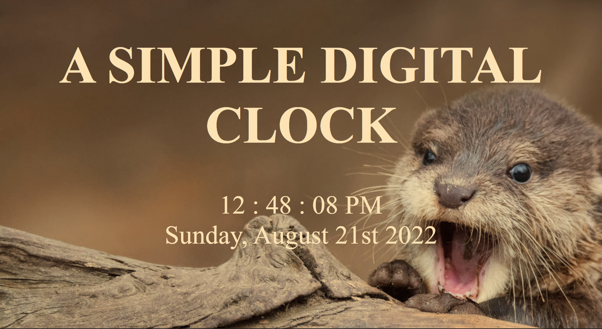

Simple Digital Clock 

https://quietoutthere.github.io/simple_clock/

The bulk of this project was created using Java Script. It's a basic digital clock that not only tells the time, but the date as well.

Author:
Evan Oyster - Full Stack Developer
[LinkedIn](https://www.linkedin.com/in/evan-oyster-442121249/) 

